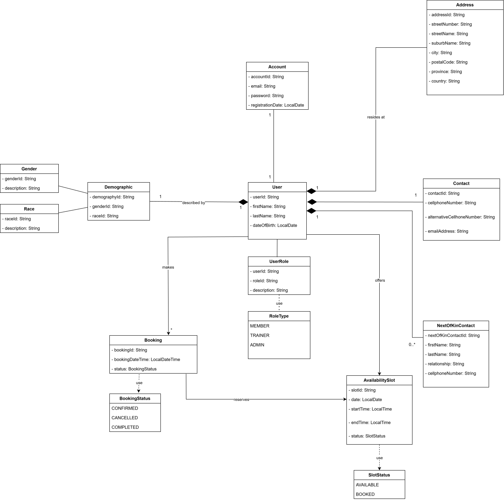

# FitNova - Fitness Management System

## Table of Contents
1. [Introduction](#1-introduction)
2. [Project Objectives](#2-project-objectives)
3. [Project Scope](#3-project-scope)
4. [System Constraints & Assumptions](#4-system-constraints--assumptions)
5. [Expected Outcomes](#5-expected-outcomes)
6. [UML Diagram](#6-uml-diagram)

---

## 1. Introduction

The operational efficiency of a modern gym or fitness centre depends heavily on the seamless coordination of its members, trainers, and facilities. In many establishments, this coordination is still managed through manual processes such as spreadsheets, paper logs, and disparate digital tools, or through basic, uncoordinated booking methods. These fragmented approaches often lead to systemic inefficiencies, including double-booked sessions, missed appointments, scheduling conflicts, and a lack of transparent communication between members and trainers. Beyond operational chaos and lost revenue, such issues erode member satisfaction and trust.

To address these challenges, this project proposes **FitNova**, a centralized, automated, and user-centric Fitness Management System. FitNova streamlines the core operational workflows of a fitness facility by enforcing strict business rules and providing role-based access, ensuring data integrity and delivering a reliable, conflict-free experience for every user.

---

## 2. Project Objectives

The primary objective of FitNova is to provide a robust framework for managing a gym's core entities: members and trainers, and their interactions. The system is designed to:

- **Secure Access Control** — Ensure that only authenticated, registered members can access the platform to create bookings, preventing unauthorized use and maintaining a clear audit trail.
- **Establish Unique Identity** — Maintain unique identifiers for all members and trainers to ensure accountability, prevent duplicate records, and accurately track activity across the platform.
- **Facilitate Proactive Availability Management** — Empower trainers to define their own availability through discrete, manageable time slots. Each slot has a clear status (`AVAILABLE` or `BOOKED`) and is linked exclusively to a single trainer, giving complete visibility into scheduling capacity.
- **Enable Conflict-Free Booking** — Allow members to book only future, available slots, while the system proactively prevents double-booking for both members and trainers, ensuring no overlapping sessions occur under any circumstances.
- **Provide Comprehensive Booking Management** — Give members full control over their schedules by allowing them to view, modify, and cancel their own bookings, provided the cancellation occurs before the session's start time. Upon cancellation, the affected slot automatically reverts to `AVAILABLE` for other members to book.
- **Enforce Role-Based Business Logic** — Implement strict role-based access control (RBAC), where members can only interact with their own bookings and trainers can only manage their own availability, safeguarding data privacy and maintaining clear accountability boundaries.
- **Guarantee Real-Time Consistency** — Validate all booking actions; creation, modification, and cancellation in real time against current system data, preventing race conditions and ensuring strict adherence to all business rules.

---

## 3. Project Scope

This document defines the scope for the **Minimum Viable Product (MVP)** of FitNova. The MVP focuses on delivering a complete, functional core experience that lays the foundation for future enhancements.

### In Scope (MVP Features)

**Member Management**
- Secure registration and login for new and existing members, with unique member IDs generated on account creation.

**Trainer Management**
- Profile management for trainers, allowing them to maintain their information and view their schedules.

**Availability Management**
- A dedicated interface for trainers to create, view, update, and delete their own availability time slots, each clearly marked with date, time, and status.

**Booking Workflow**
- *Creation* — Members can view a list of available future slots across trainers and book a slot in a single, validated transaction.
- *Viewing* — Members can view a comprehensive list of their upcoming and past bookings, sorted chronologically.
- *Cancellation* — Members can cancel future bookings; the system automatically releases the associated time slot back to `AVAILABLE`.

**Business Rule Enforcement**

All system logic is underpinned by automated checks that prevent:
- Double-booking of a member (no overlapping sessions for the same member)
- Double-booking of a trainer (no overlapping sessions for the same trainer)
- Booking of past or already-booked slots
- Cancellations after a session has started

**Role-Based Access Control**
- Users can only access data and perform actions relevant to their role (Member or Trainer), with no cross-management capabilities.

### Out of Scope (Future Enhancements)

- Administrative user roles with system-wide oversight and reporting capabilities
- Recurring booking patterns (e.g., weekly recurring sessions)
- Automated notifications (email, SMS) for booking confirmations, reminders, and cancellations
- Payment processing and subscription management integration
- Facility and resource management (e.g., booking gym equipment, group classes, or rooms)
- Advanced analytics and reporting dashboards for gym owners
- Waitlisting functionality for fully booked slots
- Mobile application (the initial MVP is web-based)

---

## 4. System Constraints & Assumptions

| Constraint | Description |
|---|---|
| **Data Integrity** | Members and trainers are distinct entities with unique, system-generated IDs. Account sharing is strictly prohibited, and each user is responsible for their own credentials. |
| **Temporal Logic** | Bookings can only be created for time slots in the future relative to the current server time. Cancellations are only permitted up to the exact start time of the session. Any action on a slot that has already begun is rejected by the system. |
| **Conflict Prevention** | An overlapping session is any instance where a member or trainer has another booking whose time range intersects with the requested booking. Such overlaps are strictly forbidden at the point of creation. |
| **Separation of Concerns** | The system's logic strictly separates responsibilities: a trainer's functions are limited to managing their own availability, and a member's functions are limited to managing their own bookings. There is no cross-management capability in the MVP. |
| **Atomic Operations** | All booking operations are treated as atomic transactions to prevent race conditions in a multi-user environment, ensuring a single available slot cannot be double-booked by two members making simultaneous requests. |
| **Single Facility Assumption** | The MVP assumes a single gym location. Multi-location support is a future enhancement. |

---

## 5. Expected Outcomes

| Outcome | Description |
|---|---|
| **Operational Efficiency** | Elimination of manual scheduling errors, double-bookings, and missed appointments, reducing administrative overhead and streamlining daily operations for gym staff. |
| **Enhanced User Experience** | Members benefit from a reliable, self-service platform for managing their fitness journey. Trainers gain clear control over their schedules, reducing stress and freeing them to focus on delivering quality sessions. |
| **Data Integrity & Reliability** | A centralized system ensures all data is consistent, auditable, and reflects the ground truth of the facility's schedule at any given moment — a single source of truth for all stakeholders. |
| **Conflict-Free Scheduling** | Core business rules guarantee that no member or trainer is ever assigned to two overlapping sessions, ensuring smooth, professional, and trustworthy operation. |
| **Scalable Foundation** | The MVP establishes a clean, modular architecture that can be extended to include administrative dashboards, notifications, and payment systems in future iterations. |

---

## 6. UML Diagram

The diagram below models FitNova's core domain entities — `User`, `Account`, `Demographic`, `Contact`, `Address`, `Booking`, `AvailabilitySlot`, and their supporting lookup types — along with the relationships and multiplicities between them.

